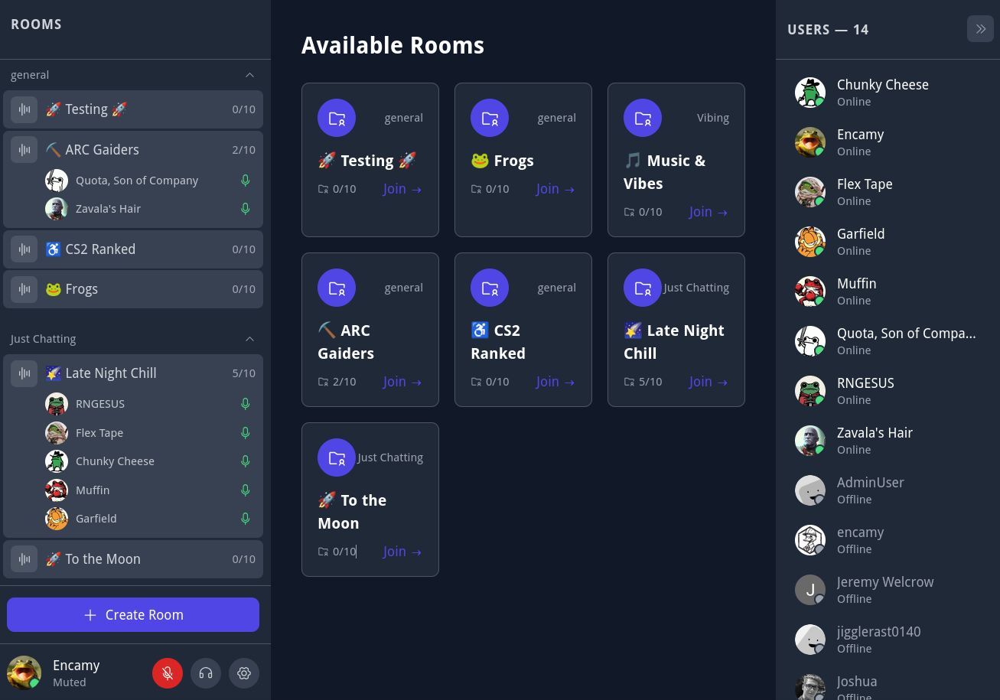
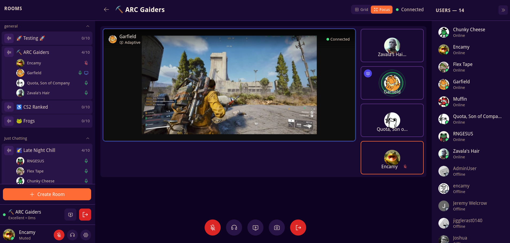
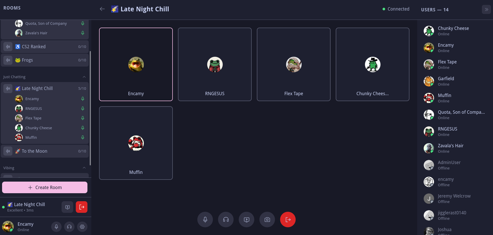
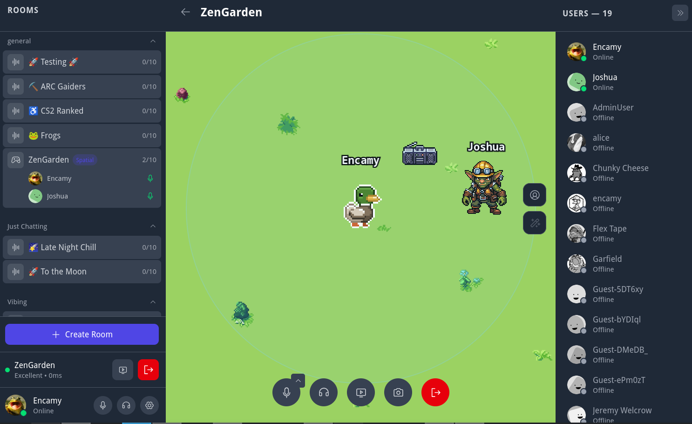

# The Orbital

A simple yet powerful voice communication platform for small amount of people. Similar to Discord but built for simplicity.

## AI Disclaimer

This project is built by AI (like 90%). AI is not perfect, but MVP was built in 2 weeks and it does its job. I just do not want to waste 6 months handcrafting artisanal code

## Screenshots







## Features

- **Voice Rooms** - Create and join voice rooms with up to 10 participants (in theory it is limited only by your network, cause livekit is able to handle about 3k users per room)
- **LiveKit SFU** - Scalable Selective Forwarding Unit for reliable voice communication
- **Text Chat** - Real-time text messaging within voice rooms
- **Desktop App** - Standalone Electron application for Linux and Windows with auto-update system
- **Screen Sharing** - Share your screen with quality options (720p, 1080p 60fps, text-optimized)
- **Process audio sharing** - Share audio of the specific application. Currently works only on linux with pipewire
- **Advanced Audio Processing**
  - Multiple noise suppression algorithms (LiveKit Native, Browser Native, Speex, RNNoise)
  - Echo cancellation
  - Automatic gain control
- **OAuth authentication** - Supports OAuth2 providers Google and Discord.
- **Password authentication** - Basic email + nickname + password schema. WITHOUT sending emails, password recovery, etc. Just a simple storage
- **Simple Deployment** - Frontent + Backend + LiveKit is all what you need. No complex modules like MAS, no custom path rewriting
- **Persistence** - Backend stores data in sqlite database. Easy management, easy deployment, easy life
- **Role-Based Access Control** - Granular permissions for different user types
- **Per-user custom soundpacks** - Every user can select one of the provided soundpacks for media presence events. Other users will hear this customization, with the ability to override the preference to avoid suffering from misuse
- **Spatial Audio** - 2D world map with character sprites and proximity-based voice attenuation
- **Boombox Music System** - In-world DJ with spatialized music playback, track upload, and admin management
- **Custom themes** - Features a selection of classic UI themes like Catppuccin, True Black, Solarized, etc

## Role-Based Access Control

The Orbital implements a hierarchical role system:

| Role | Description |
|------|-------------|
| **Guest** | Unauthenticated users who can only join rooms |
| **User** | Authenticated users via OAuth (Discord/Google) or using password |
| **Admin** | Can create, edit, and delete rooms and categories |
| **Super Admin** | Can promote/demote users to/from admin role |

### Permission Matrix

| Action | Guest | User | Admin | Super Admin |
|--------|-------|------|-------|-------------|
| Join rooms | ✅ | ✅ | ✅ | ✅ |
| Share screen | ❌ | ✅ | ✅ | ✅ |
| Create rooms | ❌ | ❌ | ✅ | ✅ |
| Update rooms | ❌ | ❌ | ✅ | ✅ |
| Delete rooms | ❌ | ❌ | ✅ | ✅ |
| Create categories | ❌ | ❌ | ✅ | ✅ |
| Delete categories | ❌ | ❌ | ✅ | ✅ |
| Reorder rooms/categories | ❌ | ❌ | ✅ | ✅ |
| Kick users from room | ❌ | ❌ | ✅ | ✅ |
| Promote users to admin | ❌ | ❌ | ❌ | ✅ |
| Demote admins to user | ❌ | ❌ | ❌ | ✅ |

**Notes:**
- The first user to log in via OAuth automatically becomes Super Admin
- Super Admin cannot demote themselves (prevents accidental lockout)

## Tech Stack

### Frontend
- Vue 3 + TypeScript + Tailwind CSS
- LiveKit Client SDK for real-time communication

### Backend
- Go 1.25+
- LiveKit Server SDK for room management
- WebSockets for signaling
- REST API for room and user management

## Development

### Prerequisites
- Node.js 18+
- Go 1.21+
- Docker & Docker Compose

### Available Commands
- `make install` - Install all dependencies
- `make build` - Build frontend and backend
- `make dev` - Run development servers
- `make run-build` - Run build artifacts
- `make dev-public` - Run development servers on 0.0.0.0 address
- `make lint` - Run linters for both frontend and backend
- `make test` - Run test suite
- `make docker-build` - Build Docker images
- `make docker-up` - Run with Docker Compose
- `make clean` - Clean build artifacts
- `make licenses` - Generates license information for deps
- `make dev-electron` - Run electron in dev mode
- `make build-electron` - Build electron app
- `make build-electron-win` - Build windows electron app
- `make build-electron-linux` - Build linux electron app (.AppImage, .deb, .tar.gz)

## Spatial Audio System



The Orbital features a spatial audio experience with a real-time 2D world where participants are represented as animated character sprites:

- **2D world map** — shared visual space rendered with PixiJS for smooth hardware-accelerated graphics
- **Multiple rendering layers** — background, background-decorations, ground, ground-decorations, decoration, and sky layers with distinct z-index values
- **Animated character sprites** — 9 unique characters with directional walk animations (up/down/left/right) and idle states
- **Animated tile sprites** — make the world alive
- **Proximity-based voice** — audio volume attenuates based on distance between characters; users outside the earshot radius are muted
- **Precise tile collision** — SAT-based polygon collision system with axis-separated resolution (wall sliding) and debug overlay (press `C` to toggle)

### Boombox Music System

A spatial music playback system that plays audio from a fixed world position:

- **In-world boombox** — a boombox sprite placed on the map plays audio to nearby users with spatialized audio
- **Upload or pick** — users can upload `.mp3` / `.opus` files (max 50MB) or select from system-curated tracks
- **Admin management** — admins can rename and delete audio files via the admin panel

### Custom Worlds

The spatial world uses a tile-based system with data exported from **Godot 4**. Each room can have its own world.

The rendering pipeline uses 6 z-ordered layers: background → background-decorations → ground (where characters walk) → ground-decorations → decoration → sky.

#### Multi-Tileset Support

Each **TileMapLayer** can use its own independent **TileSet** resource, and a single layer can mix tiles from multiple tilesets. The export script assigns each unique `(TileSet, source_id)` pair a sequential global source ID and exports its texture separately. Each tile in the `world.json` carries its own `sourceId`, allowing tiles from different tilesets to coexist in the same layer.

#### Collision System

The world uses a SAT (Separating Axis Theorem) collision system with convex polygon decomposition:

- **Per-tile collision** — every tile carries a per-tile `collidable` flag and optional `collisionPolygons` (array of convex polygons). Tiles on any layer can participate in collision — the system scans all layers for tiles with collision data.
- **Physics layer polygons** — collision polygons drawn in Godot's physics layer are exported as top-left-relative points. Non-rectilinear polygons (e.g., L-shaped tiles with diagonal inner corners) are decomposed via scanline Y-slice into axis-aligned rectangles before SAT resolution.
- **SAT resolution** — axis-separated X/Y resolution (wall sliding feel) with a final full-MTV correction pass (up to 2 iterations, minimum-penetration push).
- **Debug overlay** — press `C` in a spatial world room to toggle a red overlay showing actual collision polygons and a green hitbox outline.

#### Collision Polygon Export

When a tile has collision polygons defined in Godot's physics layer, the export captures them as center-relative points and offsets them by `tile_half_px` to convert to top-left-relative. The frontend receives them as `collisionPolygons: [number, number][][]` per tile and uses them directly in SAT collision tests.

Without physics layer polygons, tiles fall back to a legacy `collidable` boolean flag that generates a full-tile rectangle.

#### Tile Animation

Tiles can be animated using horizontal strip frames in the atlas. The export reads frame count via `get_tile_animation_frames_count()` and frame duration via `get_tile_animation_frame_duration()`. Tiles with `animation_mode = ANIMATION_MODE_RANDOM_START_TIMES` (set in Godot's `TileSetAtlasSource`) get a `randomOffset: true` flag — the frontend picks a random starting frame so adjacent tiles don't animate in sync.

#### 1. Set up your Godot scene

Create a `TileMapLayer` node for each layer. Naming determines how the layer is handled:

| Layer name | Render pass | Description |
|------------|-------------|-------------|
| `background` | Below characters (ground) | Water, space tiles, sky — rendered first |
| `background-decorations` | Below characters (ground) | Animated foam, water edge details — on top of background, below ground |
| `ground` | Below characters (ground) | Floor tiles, paths — rendered on top of background-decorations |
| `ground-decorations` | Below characters (ground) | Flowers, rocks, puddles — rendered above ground, below elevation |
| `collision` | (invisible) | Tiles that block player movement |
| `decorations` | Above characters (decoration) | Treetops, signs, lamps |
| `elevation` | Above characters | elevation cliffs |
| `sky` | Above characters (foreground) | Cloud layers, sky elements — rendered above everything else |
| `objects` | — | Contains Marker2D children for placed props |

Layers render in order: `background` → `background-decorations` → `ground` → `ground-decorations` → `decoration`/`elevation` → `sky`.

**TileSet custom data layers** (define on tiles in your TileSet):
- `collidable` (bool) — whether the tile blocks movement (used when no physics collision polygons are drawn)
- `animated` (bool) — whether the tile cycles through animation frames

**To define collision polygons**: draw collision shapes on tiles in Godot's **Physics Layer 0** of the TileSet. The export automatically detects polygons and sets `collidable = true` on the tile.

**To enable random animation starts**: set the TileSetAtlasSource's tile animation mode to `ANIMATION_MODE_RANDOM_START_TIMES` (value `1`) in Godot's TileSet editor.

**Spawn point**: Place a `Marker2D` named `SpawnPoint` anywhere in the scene. Falls back to the center of the world if missing.

**Boombox position**: Place a `Marker2D` named `Boombox` where the boombox should appear. Falls back to `(0, -200)` if missing.

**Object metadata** (on Marker2D children inside the `objects` layer):
- `tile_id` (int) — which tileset tile ID this object uses
- `animated` (bool) — enable frame animation
- `collision_w` / `collision_h` (int) — collision hitbox dimensions

#### 2. Run the export script

```bash
# Open your Godot 4 project, then:
# Project > Tools > Export Orbital World
```

This produces:
- `world.json` — tile grid, per-tile source IDs, collision polygons, animation data, object placements, spawn point, boombox position
- `tileset_0.png`, `tileset_1.png`, … — one texture per unique TileSet source in the scene

#### 3. Provide assets

Place the exported files inside `frontend/public/assets/worlds/<world_id>/`:

```
frontend/public/assets/worlds/
├── my_world/
│   ├── world.json
│   ├── tileset_0.png
│   ├── tileset_1.png
│   └── tileset_2.png
└── default/
    ├── world.json       # (empty fallback, ships with the app)
```

#### 4. Assign the world to a room

When creating or editing a spatial audio room, set the `world` field to your world ID (the directory name). The frontend loads `assets/worlds/<world_id>/world.json` automatically.

If no `world` is specified, rooms default to `"default"`, which is an open space with a boombox and no tiles.

## Audio Processing

The Orbital supports multiple noise suppression algorithms:

- **LiveKit Native** - Built-in LiveKit noise suppression (SFU-optimized, low latency)
- **Browser Native** - Uses built-in browser audio processing
- **RNNoise** - High-quality ML-based noise suppression (requires 48kHz microphone)
- **Speex** - Fast CPU-efficient noise suppression

## Deployment

Note that this section describes my personal setup and it can and it WILL be different for your usecase

### Production Architecture

My setup of the Orbital uses a split-traffic architecture for optimal performance:

- **Traefik (Load Balancer)**: Handles SSL termination for API/WebSocket traffic via path-based routing (`/livekit`)
- **LiveKit (Host Network)**: Media traffic goes directly to LiveKit using host networking for zero-overhead performance

#### Traefik Configuration

Use path-based routing to proxy LiveKit WebSocket connections through your main entrypoint:

```yaml
# Traefik routers configuration
routers:
  livekit:
    entryPoints:
      - "https"
    rule: "Host(`your-domain.com`) && PathPrefix(`/livekit`)"
    middlewares:
      - strip-livekit-prefix
      - default-headers
    tls: {}
    service: livekit

middlewares:
  strip-livekit-prefix:
    stripPrefix:
      prefixes:
        - "/livekit"

services:
  livekit:
    loadBalancer:
      servers:
        - url: "http://your-livekit-host:7880"
      passHostHeader: true
```

Then set your `LIVEKIT_URL` in `.env`:
```bash
LIVEKIT_URL=wss://your-domain.com/livekit
```

#### Required Ports

| Port | Protocol | Purpose | Route |
|------|----------|---------|-------|
| 7880 | TCP | API/WebSocket | Via Traefik (SSL, path `/livekit`) |
| 7881 | TCP | ICE/TCP fallback | Direct to LiveKit |
| 3478 | UDP | TURN/UDP relay | Direct to LiveKit |
| 62000-65535 | UDP | WebRTC media | Direct to LiveKit |
| 5349 | TCP | TURN/TLS | Direct to LiveKit (or 443 if no LB) |

### Docker Compose Deployment

The production deployment uses host networking for LiveKit:

```bash
# Copy the deployment compose file
cp docker/docker-compose.deploy.yml /opt/orbital/docker-compose.yml

# Start services
cd /opt/orbital && docker compose up -d
```

LiveKit will bind directly to host network interfaces. Ensure the required ports are open on your firewall.

Checkout [deploy.yml](.github/workflows/deploy.yml) to see how it is deployed in the real world

## Audio sprites

UI SFX supports custom audio sprites. To create a new pack:

### 1. Gather audio samples

Name your audio files according to the supported events:

| Event | Description |
|-------|-------------|
| `join_room` | Played when user joins a voice room |
| `leave_room` | Played when user leaves a voice room |
| `mute` | Played when user mutes themselves |
| `unmute` | Played when user unmutes themselves |
| `deafen` | Played when user deafens themselves |
| `undeafen` | Played when user undeafens themselves |
| `camera_start` | Played when user starts their camera |
| `camera_stop` | Played when user stops their camera |
| `screenshare_start` | Played when user starts screen sharing |
| `screenshare_stop` | Played when user stops screen sharing |

### 2. Generate sprite with audiosprite

```bash
# Install audiosprite globally if needed
pnpm install -g audiosprite

# Generate sprite files
audiosprite --output pack_name *.mp3
```

This produces multiple audio files and a sprite definition (`pack_name.json`).

### 3. Provide assets

Place audio files inside `public/assets/`

### 3. Convert to TypeScript

Place `pack_name.json` into the project root directory, then run:

```bash
pnpm run convert:soundsprite -- pack_name.json
```

This generates a TypeScript sprite definition in `services/sprites/packName.ts`.

### 4. Register the sound pack

Include the generated sprites in `sounds.ts` to make the pack available in the app.

# Known issues:

## Global hotkeys (Linux + Wayland + KDE Plasma)

For some reason, electron fails to unregister global hotkeys on wayland DE. So if you change hotkeys, you may need to clear old hotkeys manually in Settings > Keyboard > Shortcuts > Orbital

# Building on Windows

Don't... Simply don't. If you value your time, avoid building this project on Windows at any cost.

Windows is not intended for good developer experience  
- Make scripts won't work out of the box
- You will get odd libvips problems (h2non\bimg@v1.1.9\image.go:93:49: undefined: Gravity) with backend (and you will have to use docker for the backend)

